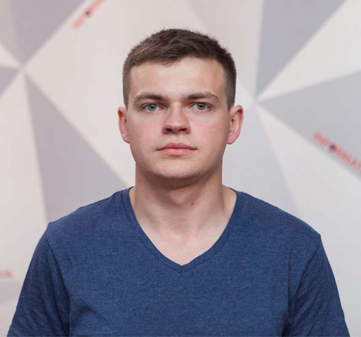

# Shushpan Andrii



## My contact info:
* **Phone:** +380 73 404 68 04
* **E-mail:** john.galt.prog@gmail.com
* **GitHub:** [John-Galt-Pro](https://github.com/John-Galt-Pro "MyGitHub")
* **Telegram:** [JohnGalt01](https://t.me/JohnGalt01 "MyTelegram")
* **Discord:** [John-Galt-Pro (@John-Galt-Pro)](https://discord.gg/QvEYg7EaQ4 "MyDiscord")

## About me
I’m twenty-nine old. In my past life I worked as a videographer. When I was a child, filming was my hobby, which became a profession. But I also like computers and everything related to them. For years I have dreamed of becoming a web developer but I didn't have enough time to study. Now I am completely free and ready to absorb knowledge like a sponge. I believe that I can achieve my dream and become a web developer.

> Who Is John Galt?

## Skills
* HTML
* CSS (Bootstrap, SASS/SCSS, BEM)
* Git/GitHub
* Figma, Zeplin, Photoshop

## Code Examples
```javascript
// Multiples of 3 or 5

/* Finish the solution so that it returns the sum of all the multiples of 3 or 5 below the number passed in. 
Additionally, if the number is negative, return 0 (for languages that do have them). */

function solution(number){
    let sum = 0;
    if(number < 0) {
      return 0;
    } else {
      for(let i = number-1; i >= 3; i--){
        if(i%3 === 0 || i%5 === 0){
            sum+=i;
        }
      }
    }
    return sum;
  }
```

## Education
* **Dnipro National University of Railway Transport named after Academician V. Lazaryan**
    + obtained master’s degree field of study “Information and communications systems security”

* **Udemy**
    + [HTML/CSS](https://www.udemy.com/course/webdeveloper/ "WEB-разработчик 2022")
    + [JavaScript (just started)](https://www.udemy.com/course/javascript_full/ "Полный курс по JavaScript + React - с нуля до результата")

## Languages
* **Ukrainian** - native speaker.
* **Russian** - native speaker.
* **English** - A2 (learning now)
